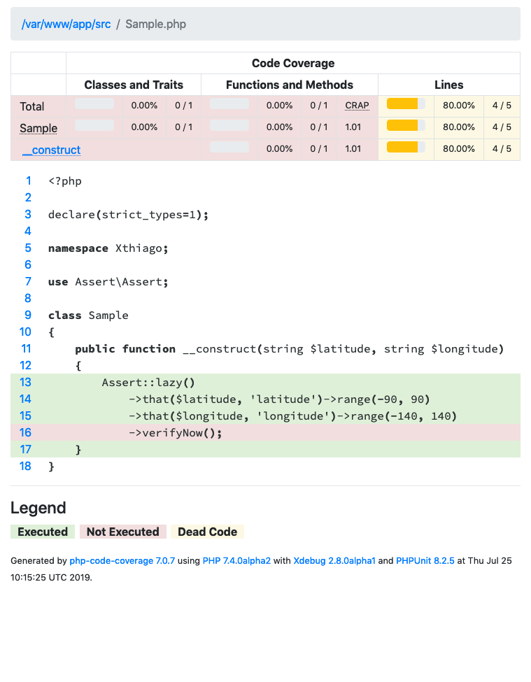

# php-code-coverage-with-incorrect-line-detection

The purpose of this repository is to provide a simple and fast way to reproduce the issue 
[Incorrect detection: line executed is marked as not executed](https://github.com/sebastianbergmann/php-code-coverage/issues/687) 
 that I had reported.
 
### Requirements

- **Docker CE** - see the [install guide](https://docs.docker.com/install/).
- **Docker Compose** - it is already included in *Docker Desktop for Mac* and *Windows*). If necessary, see the 
[install guide](https://docs.docker.com/compose/install/).

### Steps to reproduce the bug:

1. Build the docker image.

```
docker-compose build
```

2. Install composer dependencies.

```
docker-compose run php composer install
```

3. Generate the code coverage report

```
docker-compose run php phpunit tests --coverage-html="report/" --whitelist="src"
```

4. Open the report in your browser. It will look like:


